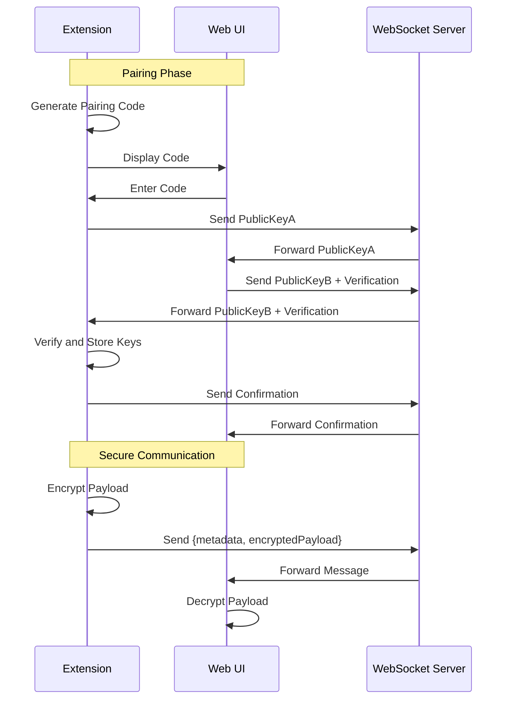

# End-to-End Encryption Implementation Plan

## Overview

Implement secure WebSocket communication between VS Code extension and web UI using:

- Per-device pairing with verification code
- Payload-only encryption (metadata remains plaintext)
- Minimal changes to existing WebSocket code

## Components

### 1. Cryptography

- Library: `libsodium-wrappers`
- Algorithms:
  - Key exchange: X25519 (Elliptic Curve Diffie-Hellman)
  - Encryption: XSalsa20-Poly1305 (authenticated encryption)
- Key storage:
  - Extension: VS Code SecretStorage API
  - Web UI: localStorage with fallback to IndexedDB

### 2. Pairing Process

1. Initiation:
   - Extension generates 6-digit pairing code
   - Displays code to user in VS Code notification
2. Code Entry:
   - Web UI shows pairing code input field
   - User enters code from extension
3. Key Exchange:
   - Clients exchange public keys over WebSocket
   - Derive shared secret using Diffie-Hellman
   - Verify using pairing code hash
4. Persistence:
   - Store peer public key and derived shared secret
   - Associate with device identifier

### 3. Message Encryption

```typescript
// Encrypted payload format
interface EncryptedPayload {
  ciphertext: string;  // base64 encoded
  nonce: string;      // base64 encoded
}

// Message format (WebSocket)
interface SecureMessage {
  id: string;
  type: string;
  action?: string;
  encryptedPayload?: EncryptedPayload;
  // ... other metadata
}
```

### 4. Code Changes Required

#### Extension Side (`src/services/websocket/`)

1. New files:
   - `crypto.ts`: Key management and encryption
   - `pairing.ts`: Pairing logic and UI
2. Modifications:
   - `client.ts`: Wrap send/receive with encryption
   - `types.ts`: Add new message types

#### Web UI Side (`webview-ui/src/lib/`)

1. New files:
   - `crypto.ts`: Browser-compatible crypto operations
   - `pairing.ts`: Pairing UI components
2. Modifications:
   - `ws-client.ts`: Add encryption layer
   - Add pairing UI components

#### Server Side

- No changes required (acts as encrypted message relay)

## Sequence Diagram



## Implementation Steps

1. Add libsodium-wrappers dependency
2. Implement crypto modules
3. Create pairing UI components
4. Modify WebSocket clients
5. Add VS Code commands for pairing
6. Test pairing flow
7. Test encrypted communication
8. Document usage

## Security Considerations

- Pairing codes should be time-limited (5 minute expiry)
- Rate limit pairing attempts
- Clear sensitive data from memory after use
- Provide pairing revocation mechanism
